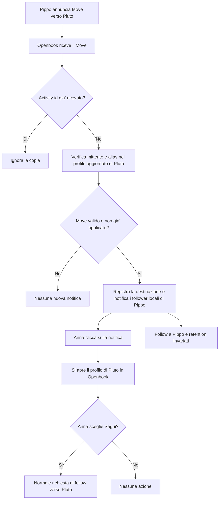

# Migrazioni degli account remoti — issue #116

**Stato:** implementazione completata e diff finale rivisto. Decisione concordata:
notifica informativa e follow soltanto su scelta esplicita dell'utente.
**Issue:** [Seguire le migrazioni degli account remoti](https://github.com/insicd/openbook/issues/116).
**Ramo:** `issue_116`, creato da `isssue_125` al commit `efe4ce4`.

## 1. Obiettivo e perimetro

Ricevere un Move autentico, notificare i follower locali del vecchio account
e mostrare sul vecchio profilo un avviso con il collegamento al nuovo.
Il click sulla notifica apre il profilo della destinazione in Openbook:
li' l'utente puo' scegliere di premere il normale pulsante Segui.

Non creare o rimuovere follow automaticamente. Conservare relazioni,
preferenze, attribuzione dei post e regole di retention e visibilita'.
Non importare lo storico. Questa e' una revisione consapevole del requisito
originario della issue: informare della migrazione, lasciando all'utente
la decisione di seguire la nuova identita'.

Sono esclusi migrazioni degli account locali, blocchi e nascondimenti
personali (altra issue), migrazioni di community e operazioni per follower
remoti. Riutilizzare i controlli amministrativi e le protezioni HTTP esistenti.
Nessuna nuova infrastruttura di code, cursori o recupero dedicato.

### Esempio e flow di processo

Anna e Marco su Openbook seguono Pippo@ServerA. Pippo prepara Pluto@ServerB,
che dichiara Pippo tra i propri alias, e annuncia la migrazione.
Openbook verifica l'annuncio e notifica Anna e Marco. Entrambi continuano a
seguire Pippo; ciascuno decide autonomamente se seguire anche Pluto.

### Consegne multiple e deduplicazione

Un Move e' un'attivita' identificata dal proprio `id`; il numero di richieste
HTTP dipende dal mittente. Openbook pubblica una sharedInbox comune (`/inbox`):
il mittente puo' inviarvi una copia per tutti i follower locali, oppure
consegnare copie alle inbox individuali, oltre a eventuali retry.
La [specifica ActivityPub](https://www.w3.org/TR/activitypub/#shared-inbox-delivery)
consente il raggruppamento tramite sharedInbox.

InboxController deduplica gia' globalmente per `activity.id`, con un vincolo
univoco su `inbox_items.remote_activity_uri`, anche fra inbox diverse.
Il servizio deve selezionare tutti i follower locali interessati, senza
limitarsi a `target_actor_id` della prima inbox: Anna e Marco ricevono
ciascuno la propria notifica, anche se viene elaborata una sola attivita'.
Le notifiche gia' presenti per sorgente, destinazione e destinatario vengono
riusate come controllo contro annunci ripetuti con un activity id differente.
Il solo collegamento fra profili non indica che sia arrivato un Move.

## 2. Riuso del codice esistente

| Componente | Intervento |
|---|---|
| `InboxController` | Riusare autenticazione, deduplicazione e accodamento. Nessuna nuova route. |
| `InboxActivityProcessor` | Aggiungere il ramo Move delegando a un servizio dedicato. |
| `RemoteActorResolver` | Riusare refresh e fetch protetto; leggere gli alias necessari alla verifica. |
| `follows` | Leggere i follower locali accettati della sorgente. Nessuna scrittura. |
| `NotificationCreator` / `Notification` | Nuovo tipo, testo e link al profilo della destinazione; riusare polling e push. |
| Profilo remoto | Avviso con link al nuovo account, senza redirect automatico. |
| `FollowManager` / `ActivityDelivery` | Nessuna nuova orchestrazione: intervengono solo se l'utente preme Segui. |

Riferimenti: `app/Federation/Inbox/`, `app/Federation/Actors/`,
`app/Application/Services/NotificationCreator.php`,
`app/Domain/Notifications/Notification.php` e
`resources/views/actors/show.blade.php`.

## 3. Verifica della migrazione

Secondo la [documentazione Mastodon](https://docs.joinmastodon.org/spec/activitypub/#account-migration-move),
actor e object identificano il vecchio account, target il nuovo, e la
destinazione deve dichiarare il vecchio URI nel proprio `alsoKnownAs`.

Il servizio verifica:

1. actor e object corrispondono all'identita' autenticata dall'inbox;
2. target e' diverso dalla sorgente e identifica un account remoto seguibile,
   non un account locale, un Group o un Feed RSS/Atom;
3. il documento della destinazione e' recuperato tramite il resolver con
   le protezioni esistenti e un refresh effettivo, senza fidarsi soltanto
   della cache o di un documento incorporato nel Move;
4. l'id restituito corrisponde al target e gli alias contengono la sorgente;
5. non ci sono blocchi amministrativi o stati che impediscono il follow.

Riutilizzare i confronti URI esistenti senza ampliare globalmente le regole
di equivalenza. I bot remoti seguibili rappresentati come Application
rientrano nel perimetro.

Una firma o un alias non valido non produce notifiche di migrazione. Se il fetch
fallisce, non creare notifiche o registrare la destinazione; usare
l'esito ignored previsto per attivita' non applicabili, senza costruire un
sistema di retry specifico per Move. Il resolver attuale restituisce null anche per
errori di rete: un fetch fallito non deve essere presentato come una verifica
riuscita sulla base della vecchia cache.

Il solo `movedTo` ricevuto in un Update o durante la visita al profilo non
genera notifiche di migrazione. Non aggiungere crawling o inseguimento ricorsivo delle
migrazioni. Self-move e cicli conosciuti sono rifiutati.

## 4. Dati e servizio proposti

Un servizio dedicato vicino agli Actor federati verifica il Move e usa
NotificationCreator. Il processor si limita a invocarlo. Il nome dovra'
esprimere la gestione dell'annuncio, senza suggerire un trasferimento dei follow.
Non serve una tabella delle migrazioni.

Dati proposti su `actors`:

- `also_known_as`: alias dichiarati, limitati e validati, letti dal resolver;
- `moved_to_actor_id`: riferimento nullable alla destinazione, importato anche
  dal `movedTo` del profilo remoto.

Il secondo riferimento serve all'avviso sul profilo. Non prova che un Move
sia stato ricevuto e non deve sopprimere le notifiche di un Move successivo.
Un normale Update che omette movedTo non lo
cancella. La notifica ha Pippo come autore dell'annuncio e Pluto come oggetto
notificabile: il link punta direttamente alla destinazione senza dipendere
da successivi aggiornamenti della sorgente.

Verificare schema su SQLite e MySQL/MariaDB e piano EXPLAIN della query
concreta dei follower locali. Nessuna modifica alle query delle timeline.

## 5. Elaborazione locale

Recuperare e verificare il profilo della destinazione prima della transazione.
Poi, in una normale transazione:

1. Rileggere sotto lock la sorgente. Un target diverso non sovrascrive
   automaticamente quello precedente. Leggere le notifiche gia' presenti
   per lo stesso annuncio e saltare i destinatari gia' notificati.
2. Selezionare i follower accepted dei Person locali con utente attivo.
3. Creare per ciascuno la notifica di migrazione.
4. Salvare il riferimento alla destinazione e completare la transazione.

La transazione evita che un errore locale lasci notifiche parziali insieme
al collegamento alla destinazione. Riusare il normale accodamento push dopo
il commit. Non introdurre un recupero speciale per Move.

Il Move non genera attivita' federate in uscita, firme per follower o
richieste Follow. Dopo la verifica iniziale del profilo, l'elaborazione
riguarda soltanto dati e notifiche locali. Non e' richiesto un benchmark
con 5.000 follower sintetici.

## 6. Esperienza utente

Testo italiano proposto:

> Pippo si e' trasferito su Pluto. Visita il nuovo profilo se vuoi continuare a seguirlo.

Mostrare gli handle completi quando necessario per distinguere gli account.
La notifica porta direttamente al profilo di Pluto in Openbook. Il click
non esegue un follow e non apre una conferma aggiuntiva: il profilo offre
il normale pulsante Segui, con gli stati gia' esistenti se Anna segue gia'
Pluto o ha una richiesta in attesa.

Anche una normale visita al vecchio profilo importa `movedTo`: si cerca
l'Actor remoto nel database e lo si recupera tramite il resolver protetto
solo se manca. Si salva il suo id nel campo esistente, senza notifiche.
Non si risolvono ricorsivamente gli ulteriori `movedTo` della destinazione.
Valori non validi, self-move, destinazioni locali o bloccate sono ignorati;
un fetch fallito non impedisce l'aggiornamento degli altri dati del profilo.
Non si aggiungono colonne o migrazioni.

Il vecchio profilo resta consultabile con i suoi post e un avviso:
"Questo account si e' trasferito su Pluto", collegato al nuovo profilo.
Non introdurre nuove restrizioni ai follow del vecchio profilo in questa issue.

## 7. Decisioni di comportamento

| Caso | Decisione |
|---|---|
| Follow alla sorgente o destinazione | Nessuna modifica automatica, comprese le preferenze di auto-announce. |
| Follower con richiesta pending alla sorgente | Non notificare: destinatari sono i follower accepted. |
| Follower che segue gia' la destinazione | Riceve comunque l'informazione; il profilo mostra lo stato esistente. |
| Move duplicato | Deduplicazione per activity id e notifiche gia' presenti per gli stessi destinatari. |
| Nuovo target per una sorgente gia' migrata | Non sovrascrivere automaticamente la destinazione registrata. |
| Catene di migrazioni | Non inseguirle automaticamente. |

## 8. Verifiche essenziali

- Move autentico e rifiuto di firme, identita' o alias errati; refresh reale,
  target seguibile, controlli amministrativi e protezioni HTTP esistenti.
- Selezione di tutti i follower locali accepted, anche ricevendo il Move
  dall'inbox individuale di uno solo di loro.
- Una notifica per destinatario, deduplicazione per activity id e per
  spostamento gia' registrato, rollback su errore locale.
- Nessun follow creato, rimosso o modificato e nessuna consegna ActivityPub
  generata dal Move, anche se il destinatario segue gia' il nuovo account.
- Link della notifica al profilo nuovo, avviso sul vecchio, storico invariato,
  testi italiani e inglesi; il solo Update non genera notifiche di Move.
- Schema sui database supportati e query con piano verificato.

Test mirati durante il lavoro e suite completa prima della PR.

## 9. Piano rivisto: uno sprint

Il perimetro ridotto e' gestibile in un solo sprint: schema minimo, verifica
nel resolver, servizio e ramo inbox, nuovo tipo di notifica con link,
avviso sul profilo, test mirati, documentazione EN/IT e changelog.
Review completata; implementazione autorizzata.

**Uscita:** un Move valido informa una sola volta tutti i follower locali
interessati; la notifica apre il nuovo profilo e soltanto un click esplicito
su Segui avvia il follow ordinario. Relazioni esistenti e retention restano
invariate. Suite completa e review del diff prima della PR.

## 10. Verifica dell'implementazione

- Verifiche della prima implementazione: 14 test, 64 asserzioni, inclusa ricezione HTTP firmata dello
  stesso Move nelle inbox di Anna e Marco, due notifiche e follow invariati.
- MySQL 26.7: migrazioni applicate in un database temporaneo isolato; verificati
  down/up della nuova migrazione e null-on-delete del riferimento alla destinazione.
- EXPLAIN della query effettiva con quattro follower locali e relazioni verso
  diversi account remoti: accesso a `actors_is_local_index`, lookup univoco su
  `follows_follower_id_following_id_unique` e lookup su `users.PRIMARY`.
  Nessuna scansione completa; non sono giustificati nuovi indici per questo percorso.
  Questa verifica del piano non e' un benchmark di carico.
- Suite completa: 1.468 test, 6.521 asserzioni; 1.465 passati, 2 saltati,
  un fallimento gia' riscontrato prima di questa issue in
  `FeedTest::test_long_post_bodies_are_truncated_in_the_feed_with_a_read_more_control`
  (manca il testo `Altro...`, riga 541). Nessun fallimento nei test Move.
- Diff completo rivisto: follow e query delle timeline invariati; nessuna nuova
  route o consegna federata generata dal Move. Documentazione EN/IT e changelog
  aggiornati.

### Estensione mirata: movedTo durante la consultazione

Il collegamento `moved_to_actor_id` viene popolato anche dai normali fetch e
Update del profilo. Le notifiche restano esclusivamente nel gestore di Move,
con verifica fresca dell'alias. La deduplicazione considera le notifiche
esistenti, senza usare il collegamento informativo come prova dell'annuncio.
Una notifica eliminata non costituisce uno storico permanente di consegna;
non si introduce un registro aggiuntivo per questa funzione.

Visita del profilo e Move usano lo stesso `RemoteActorResolver::resolveMovedTo`
per risolvere e controllare la destinazione. Per il Move viene richiesto un
refresh: la verifica dell'alias prima delle notifiche deve usare il documento
attuale del nuovo account. Il riferimento salvato resta lo stesso id locale.

- Test mirati Move, resolver e profili: 60 test, 226 asserzioni, tutti passati.
- Suite completa: 1.472 test, 6.551 asserzioni, 2 saltati e il solo fallimento
  preesistente di FeedTest sul testo `Altro...` indicato sopra.
- EXPLAIN MySQL della query di deduplicazione: lookup tramite
  `notifications_actor_id_foreign`, senza scansione completa della tabella.
- Pint e controllo del diff superati; nessuna nuova colonna o migrazione.
