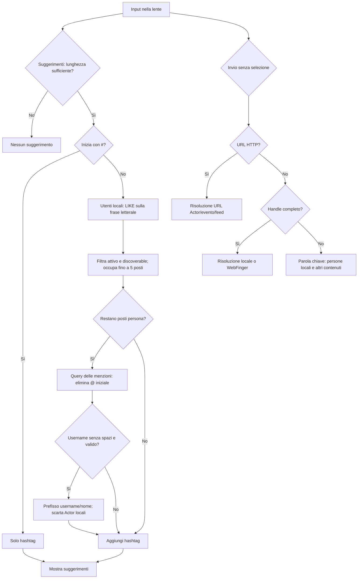
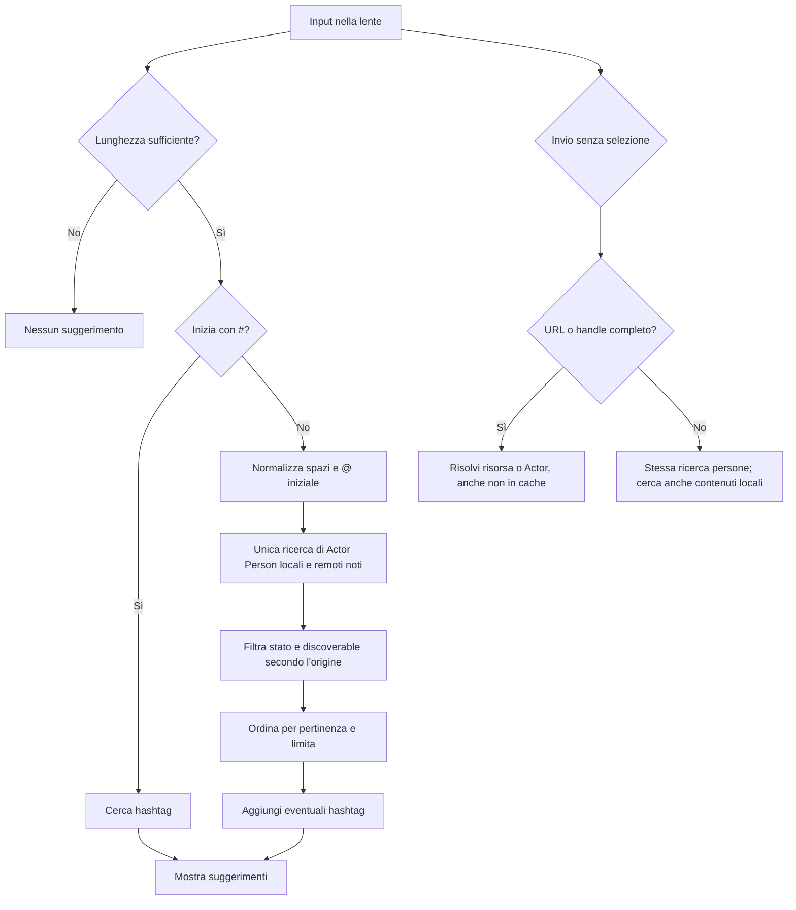

# Ricerca: persone e suggerimenti della lente

Documento di analisi per il ramo `search_improvements`. Fotografa il comportamento
attuale e definisce la strategia da discutere prima dell'implementazione. Nessuna
modifica funzionale è inclusa in questa fase.

## Problema e obiettivo

La lente nella barra superiore apre un campo di ricerca con suggerimenti mentre
si digita. Oggi la stessa persona può apparire o sparire a seconda di un `@`
iniziale o di uno spazio nel nome. Vogliamo che la ricerca delle **persone già
conosciute dall'istanza** usi regole comprensibili e coerenti per Actor locali e
remoti, preservando preferenze di visibilità, moderazione e risoluzione federata.

Esempi osservati dall'utente su un'istanza con dominio `punk.kitchen`:

| Input | Risultato osservato | Risultato atteso |
| --- | --- | --- |
| `zeldazara` | La persona locale `@zeldazarathustra@punk.kitchen` appare | Appare |
| `@zeldaz` | La persona locale non appare; possono apparire remoti `zelda*` | Appare anche la persona locale |
| `Dario` | Compare il remoto `@nuke@openb.app`, per il nome visualizzato | Compare |
| `Dario fadda` | La stessa persona scompare | Compare se il nome contiene la frase |

Questi esempi sono riportati come osservazioni dell'utente. L'analisi del codice
spiega i due meccanismi; non verifica i record del database di produzione.

## Stato attuale verificato

- Il campo della lente e quello della pagina `/cerca` usano
  `public/assets/js/search-suggest.js`. Dopo almeno due caratteri, il browser
  attende 180 ms e chiama `GET /cerca/suggerimenti?q=...`. Selezionare un
  suggerimento apre il profilo/tag; Invio senza selezione invia il form a
  `/cerca`.
- `SearchSuggestController` interroga prima `LocalSearchQuery::suggest()`:
  persone locali e hashtag. Con il limite predefinito di otto suggerimenti,
  riserva cinque posti alle persone e tre agli hashtag. Solo i posti persona
  rimasti sono riempiti con Actor remoti da `MentionSuggestQuery::forPrefix()`.
- La ricerca delle persone locali usa la frase intera come sottostringa SQL
  `LIKE` di `users.username`, `profiles.display_name` o `profiles.bio`.
  Richiede utente attivo e `user_settings.discoverable = true`. Non elimina
  un eventuale `@` iniziale: `%@zeldaz%` non corrisponde allo username
  `zeldazarathustra`.
- `MentionSuggestQuery` nasce per le menzioni nel composer: elimina il `@`
  iniziale e ammette come username cercato solo `[a-z0-9_]{1,32}`. Senza
  dominio, cerca un prefisso di `actors.preferred_username`, `actors.name` o,
  per i locali, `profiles.display_name`. Una frase con spazi viene rifiutata
  prima della query. Il controller della lente scarta poi gli Actor locali
  restituiti da questa query.
- La query delle menzioni limita gli Actor a `Person` attivi, ma non filtra
  `actors.discoverable`. Usarla per la ricerca dei remoti crea quindi una
  differenza di visibilità rispetto ai locali. La query di suggerimenti
  contestuali per bio (`SuggestedActorsByBioQuery`) mostra già come applicare
  `discoverable` a entrambe le categorie.
- La ricerca dopo Invio segue `SearchController`: URL HTTP, handle federato
  completo, altrimenti parola chiave. Un handle completo può essere risolto
  tramite WebFinger anche se l'Actor non è ancora in cache. Una parola chiave
  cerca persone **solo locali** oltre a post, commenti, hashtag ed eventi;
  non usa la stessa ricerca delle persone dell'autocompletamento.
- `FederatedHandleParser` elimina il `@` iniziale soltanto quando riconosce un
  handle con dominio. `@zeldaz`, senza dominio, resta una parola chiave
  letterale anche dopo Invio.

Riferimenti principali: `resources/views/partials/header-search.blade.php`,
`public/assets/js/search-suggest.js`, `app/Http/Controllers/SearchSuggestController.php`,
`app/Application/Queries/LocalSearchQuery.php`,
`app/Application/Queries/MentionSuggestQuery.php`,
`app/Http/Controllers/SearchController.php` e
`app/Http/Support/FederatedHandleParser.php`.

### Albero attuale: suggerimenti e invio

## Comportamento proposto

La ricerca di persone parte da una sola popolazione di candidati: gli Actor
`Person` conosciuti dall'istanza, locali e remoti. L'origine non determina né
la sintassi accettata né una quota separata di risultati. Serve solo per
applicare correttamente visibilità e URL del profilo.

1. **Classificare l'intento.** `#` iniziale cerca solo hashtag nei suggerimenti.
   Un URL o un handle completo resta nel percorso di risoluzione dopo Invio.
   Ogni altro input è testo di ricerca persone; un solo `@` iniziale è
   facoltativo e non cambia i candidati. Le ricerche ordinarie possono
   continuare a proporre anche hashtag, entro il limite dedicato.
2. **Normalizzare nel contesto della query.** Conservare il testo in ingresso
   senza modificarlo. Solo la query delle persone taglia gli spazi esterni,
   uniforma quelli interni e considera facoltativo il `@` iniziale. La query
   di contenuti usa il testo originale e le proprie regole: una menzione
   `@nome` in un post o evento non deve trasformarsi in `nome`. Anche il
   percorso URL/handle interpreta l'input originale. Suggerimenti e sezione
   Persone di `/cerca` condividono la normalizzazione **delle persone**.
   Non applicare ai nomi visualizzati la regex riservata agli username.
3. **Cercare tutte le persone con la stessa query applicativa.** Per testo
   semplice: corrispondenza su username e frase contenuta nel nome
   visualizzato, anche quando include spazi. Preservare la corrispondenza
   interna allo username, disponibile oggi per i locali, con priorità minore
   rispetto al prefisso. Per `username@dominio`, cercare username e dominio
   insieme negli Actor già noti; la risoluzione di un handle sconosciuto
   continua a essere possibile solo dopo Invio.
4. **Filtrare prima di limitare.** Solo `Person` attivi. Per i locali anche
   `users.status = active` e `user_settings.discoverable = true`; per i remoti
   `actors.discoverable = true`. Escludere Actor bloccati, sospesi o cancellati.
   La ricerca non deve richiedere una chiamata remota per ogni battuta.
5. **Ordinare per pertinenza, poi limitare.** Priorità proposta: handle esatto,
   username esatto, prefisso dello username, inizio del nome, frase contenuta
   nel nome, sottostringa dello username; usare username/dominio come
   ordinamento stabile a parità di punteggio. Nessuna precedenza automatica
   ai locali. Il limite delle persone si applica dopo filtro e ordinamento.

La ricerca nella bio locale è oggi possibile. Va preservata nei suggerimenti
e nella pagina completa, ma con priorità inferiore ai campi identificativi.
L'eventuale estensione alla bio remota
richiede una decisione separata: `actors.summary` può contenere HTML e cercarlo
come testo grezzo darebbe risultati fuorvianti. Non è necessaria per i due casi
segnalati.

### Albero proposto

L'albero descrive un obiettivo anche per la pagina `/cerca`: la sezione
"Persone" userà le stesse regole e la stessa visibilità dei
suggerimenti. La ricerca dei contenuti conserva invece i propri vincoli:
post/commenti locali indicizzabili e visibili, eventi visibili e hashtag.

## Scelte e confini

- **`discoverable` e handle esatto.** I suggerimenti e la ricerca testuale
  devono rispettare `discoverable`. La risoluzione esplicita di un handle
  completo può continuare a raggiungere un profilo non discoverable, come
  oggi: la preferenza riguarda l'inclusione in elenchi e risultati, non la
  segretezza dell'indirizzo noto. Verificare questa semantica con i test.
- **Ricerca per frase, prima dei token.** `Dario fadda` va cercato come frase
  contigua nel nome visualizzato; non occorre introdurre AND/OR fra parole,
  stemming o indici full-text per risolvere il problema. Una ricerca
  `Fadda Dario` resta fuori da questo primo intervento.
- **Menzioni del composer.** `MentionSuggestQuery` è condivisa oggi per
  convenienza, ma il composer ha regole diverse (inserire un handle durante
  la scrittura). Non cambiare la sua semantica incidentalmente; estrarre o
  riusare soltanto le parti effettivamente comuni.
- **Eventi.** Restano nella pagina completa dopo Invio, inclusi gli eventi
  remoti memorizzati che superano i filtri di visibilità. Non entrano nei
  suggerimenti mentre si digita, che continuano a proporre persone e hashtag.
  `discoverable` riguarda i risultati persona; gli eventi continuano a
  seguire le proprie regole di visibilità.
- **Limiti e deduplicazione.** Un Actor locale deve comparire una sola volta.
  Non filtrare i locali *dopo* aver applicato un limite a una query mista:
  può consumare posti e nascondere remoti idonei. Una query unica con limite
  finale elimina anche questo caso.
- **Compatibilità.** Solo query sul database disponibile; nessun motore di
  ricerca, worker o servizio obbligatorio. Escapare `%`, `_` e il carattere
  di escape nei pattern `LIKE`, come già fa `LocalSearchQuery`.
- **Prestazioni.** Le ricerche `%frase%` su nomi e bio non sfruttano un
  normale indice B-tree. Prima di estendere la query verificare tempi e
  piano reale su MySQL/MariaDB, soprattutto con `JOIN`, `OR`, ordinamento e
  limite; SQLite da sola non basta. Se servono più rami SQL, controllare
  ciascuno. Non aggiungere indici sulla sola supposizione che verranno usati.
- **Campo e UI.** Il browser deve continuare a inviare il testo senza
  reinterpretarlo e mantenere navigazione da tastiera, debounce, annullamento
  delle richieste obsolete e limiti configurati. Ogni query normalizza la
  propria copia del testo sul server secondo il contenuto che cerca.

## Strategia implementativa proposta

1. **Contratto e casi di regressione.** Aggiungere test PHPUnit per
   `zeldaz`/`@zeldaz`, nome remoto a una e due parole, handle completo,
   risultati locali e remoti nello stesso elenco, limite/ranking,
   `discoverable = false`, account disabilitato e risoluzione esplicita dopo
   Invio. Usare fixture con nomi e handle distinti, così il campo che ha
   prodotto il match è evidente.
2. **Query unica per le persone.** Introdurre una query applicativa dedicata
   alla ricerca persone che normalizzi l'input, cerchi `actors` con i dati di
   profilo locali necessari, applichi visibilità e restituisca Actor ordinati.
   Riutilizzarla per l'autocompletamento e per la sezione "Persone" di
   `/cerca`. Lasciare a `LocalSearchQuery` i contenuti e gli hashtag.
3. **Controller sottili.** Far comporre a `SearchSuggestController` i risultati
   della nuova query e gli hashtag; mantenere la risoluzione URL/WebFinger
   nel percorso dopo Invio. Non effettuare fetch federati nei suggerimenti.
4. **Verifica e documentazione.** Eseguire i test focalizzati e l'intera
   suite prima di proporre una PR. Verificare la query su MySQL/MariaDB con
   `EXPLAIN` e dati rappresentativi, oltre ai test SQLite. Aggiornare
   `docs/architecture.md` e `docs/architecture.it.md`, e le pagine di
   federazione se cambia la descrizione della ricerca; valutare
   `CHANGELOG.md` secondo `.cursor/rules/changelog.mdc` quando il
   comportamento sarà implementato.

## Verifiche tecniche da chiudere durante l'implementazione

- Definire il ranking SQL più semplice e portabile che mantenga risultati
  stabili su MySQL/MariaDB e SQLite senza penalizzare la latenza.
- Misurare l'effetto delle corrispondenze in bio locale sulla qualità dei
  primi cinque suggerimenti, mantenendole dietro ai match su username e nome.
- Verificare con fixture e query reali che i remoti già noti compaiano anche
  nella sezione persone di `/cerca`, senza cambiare la risoluzione federata
  degli handle completi o la visibilità dei contenuti.
